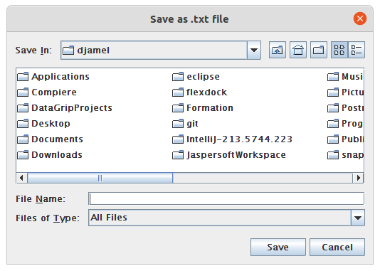

# Exercise : Java & FTP
1. Create a new java project (Java 8).
2. Connect to your Database (Compiere 3.30 Database).
### Export
3. Extract all data from ad_user table and put it in a txt file (using FTP : ftp://audaxis@192.168.30.230/home/audaxis/Formation_2022/_username_).
4. Extract all data from C_Order table quoting the number of occurrence of values ​​from C_BPartner_ID column 
### Import
4. Insert manually a new line in this txt file.
5. Import the txt file in the database 

**Notes:** 
- Make sure that only the new data will be inserted.
- Make sure your project handles all errors.
- You can create GUI 
- Use your imagination/creativity to make this this app.
- Enjoy

**One of the solution**
* Window :

* Test connection :

* Exec Query :

* Result

* Save file :

* Save locally :

* Save in Server :

* View file in Server :

